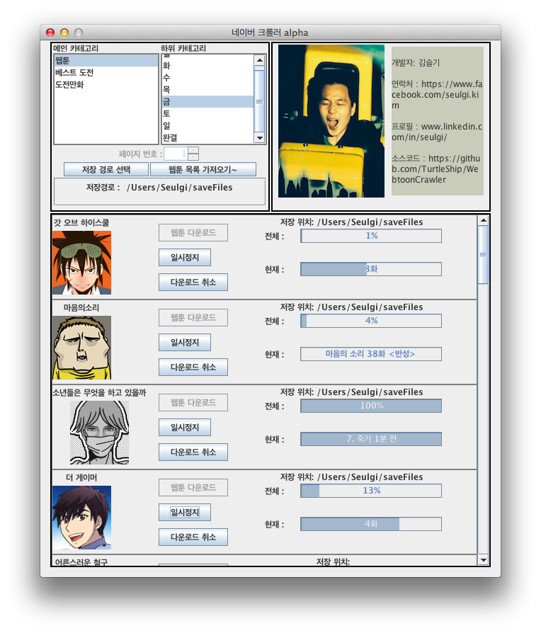

# Webtoon Crawler
*The crawler that downloads Naver, Daum, and NateOn webtoons.*

## Overview
Webtoon Crawler is a GUI-based program currently only supports downloading from Naver.

My goal is to support webtoon downloading from Daum and NateOn also.

Note that I ***didn't / couldn't receive permission for this program from any of the three vendors
since none of them provided Webtoon API***.

The program looks as below.

## Version Log
### [v1.0](https://github.com/TurtleShip/WebtoonCrawler/tree/v1.0)
- Supports webtoon downloads from Naver.

## How to run this program
1. Download [jar file](https://github.com/TurtleShip/WebtoonCrawler/raw/master/WebtoonCrawler.jar)

2.
- Windows : Double click the far file.
- Mac, Linux : Type 'java -jar WebtoonCrawler.jar' from the console.

## License
[MIT License](license.txt)

## Credit
Inspired by a project [web_crawler](https://github.com/emeraldsnail/webtoon_crawler) developed by [**emeraldsnail**](https://github.com/emeraldsnail).

